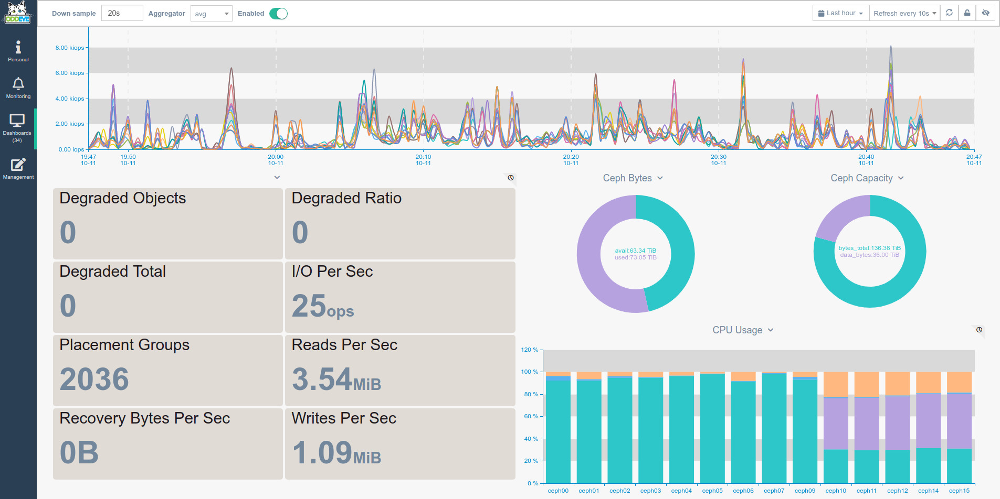

Ceph is high performance distributed storage system, for storing petabytes of data on commodity hardware.
Agent uses Ceph built in tools to expose statistics and send to OddEye servers. Configuration is very minimal and easy : 
All that is needed is to tell Agent the username, which is allowed to grab statistics (Typically client.admin) and path to keyring. 
If you run Ceph, you already have installed all needed dependencies, so nothing else is needed to add. 
Agent will look for configuration in file `bigdata.ini`. 


##### **Install**

```bash
cd ${OE_AGENT_HOME}/checks_enabled
ln -s ../checks_available/check_ceph.py ./
```

##### **Configure**

Make sure that /etc/ceph/ceph.client.admin.keyring is readable for user, which runs Agent.
If you want to use another keyring or ceph user, change `client` and `keyring` paramaters to your desired ones.
It takes cople of seconds, afterwords you can create graphs with these metrics :

```ini
[Ceph]
client: client.admin
keyring: /etc/ceph/ceph.client.admin.keyring
```

##### **Restart**

```bash
${OE_AGENT_HOME}/oddeye.sh restart
```

##### **Provides**

| Name  | Description | Type | Unit|
| ------------- | ------------- |------------- |------------- |
|ceph_num_bytes|Amount of free space in Ceph|gauge|Bytes|
|ceph_num_pgs|Total amount of placement groups |gauge|None|
|ceph_raw_bytes|Total raw space for ceph cluster|gauge|Bytes|
|ceph_raw_bytes_avail|Amount of used raw available replication is taken to account |gauge|Bytes|
|ceph_raw_bytes_used|Amount of used raw space replication is taken to account |gauge|Bytes|
|ceph_io_sec|I/O operations per second for entire cluster|rate|OPS|
|ceph_read_bytes_sec|Read bytes per second for entire cluster|rate|Bytes|
|ceph_write_bytes_sec|Write bytes per second for entire cluster|rate|Bytes|
|ceph_degraded_objects|Number of degraded objects|gauge|None|
|ceph_degraded_ratio|Ratio of degraded objects|gauge|Float|
|ceph_degraded_total|Number of total degraded objects|gauge|None|
|ceph_recovering_bytes_per_sec|Speed of recovery in bytes|gauge|Bytes|
|ceph_num_objects_recovered|Recovered objects|gauge|None|
|ceph_recovering_keys_per_sec|Recovered Keys|rate|None|
|ceph_degraded_percent|Percentage of degraded objects|gauge|Percent|
|ceph_misplaced_percent|Percentage of misplaced objects|gauge|Percent|

There isn no necessity to run check_ceph.py on all nodes of Ceph of cluster. 
Statistics from all nodes will be the same, as above mentioned stats are global at cluster level. 