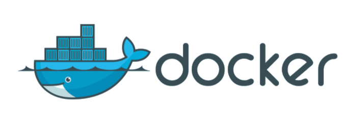

Container allows developers to package up an application with all needed parts, 
such as libraries and other dependencies, and ship it all out as one package.
**Docker** is the pioneer and the most popular solution for creating, sharing and using containers.  
**PuyPuy** works with native Dockers HTTP API to get metrics from running containers. 

#### **Install**

```bash
cd ${PUYPUY_HOME}/checks_enabled
ln -s ../checks_available/check_docker_stats.py ./
```

#### **Configure**

**Server**

To collect Docker metrics about all your containers, you will run one PuyPuy Agent on every host. 

In order to start collecting metrics from Docker you should first configure Docker server to expose metrics via HTTP socket.
In general its just adding `-H tcp://{SERVER_IP}:{PORT}` parameter to dockerd at startup.  

For SystemV and Upstart servers you should add following to `/etc/default/docker` file  

```bash
DOCKER_OPTS="-H tcp://127.0.0.1:3141"
```
If you aur using SystemD servers like Debian 8 or newer, you should edit `/lib/systemd/system/docker.service` with following parameters : 

```bash
ExecStart=/usr/bin/dockerd -H tcp://127.0.0.1:3141 -H fd://
```

After restarting docker daemon you can configure **OE-Agent** to get stats about containers from `http://127.0.0.1:3141`

**Agent**

Now when HOST server exposes its containers metrics via HTTP, you can enable `check_docker_stats` and  restart **OE-Agent**. 
Config file of `check_docker_stats` module is `conf/docker.ini`. 
If you have followed docker configuration examples above, `check_docker_stats` will works with already set up default settings. 

```ini
[Docker]
stats: http://127.0.0.1:3141/containers
detailed: True
memstats: True
prettynames: True
```

If you have configure another HOST:PORT for dockerd, please make sure to edit `conf/docker.ini` to match you configuration parameters.

#### **Provides**


Based on configuration of System and Agent, following metrics are collected from containers if  
details flag is set to True and Memory metrics are enabled: 

| Name  | Description | Type | Unit|
| ------------- | ------------- |------------- |------------- |
|docker_bytes_rx_eth0|Amounts of received bytes|rate|Bytes|
|docker_bytes_tx_eth0|Amounts of sent bytes|rate|Bytes|
|docker_container_cpu_usage|Containers CPU usage |gauge|Percent|
|docker_cpu_throttled_periods|Throttled Periods of containers CPU|counter |Milliseconds |
|docker_cpu_throttled_time|Throttled time in milliseconds  of containers CPU|counter |Milliseconds |
|docker_master_cpu_usage|Master CPU usage in percent |gauge|Percent|
|docker_mem_cur_usage|Containers current memory usage |gauge|Bytes|
|docker_mem_max_usage|Containers max memory usage |gauge|Bytes|
|docker_mem_total_active_anon|The amount of anonymous active memory|gauge|Bytes|
|docker_mem_total_active_file|The amount of anonymous file cache memory|gauge|Bytes|
|docker_mem_total_cache|Block device/cache used memory of control group |gauge|Bytes|
|docker_mem_total_inactive_anon|The amount of anonymous inactive memory|gauge|Bytes|
|docker_mem_total_inactive_file|The amount of anonymous inactive file cache|gauge|Bytes|
|docker_mem_total_mapped_file|Memory mapped by the processes in the control group|gauge|Bytes|
|docker_mem_total_rss|Memory that doesn’t correspond to disk, heaps, and anon|gauge|Bytes|
|docker_mem_total_swap|Total amount of containers swapped memory |gauge|Bytes|
|docker_mem_total_unevictable|The amount of memory that cannot be reclaimed|gauge|Bytes|
|docker_rx_dropped_eth0|RX dropped traffic|rate|None|
|docker_rx_errors_eth0|RX network errors |rate|None|
|docker_rx_packets_eth0|RX packets |rate|None|
|docker_tx_dropped_eth0|TX dropped traffic|rate|None|
|docker_tx_errors_eth0|TX network errors |rate|None|
|docker_tx_packets_eth0|TX packets |rate|None|


If details is set to False, these metrics will be collected from containers. 

| Name  | Description | Type | Unit|
| ------------- | ------------- |------------- |------------- |
|docker_bytes_rx_eth0|Amounts of received bytes|rate|Bytes|
|docker_bytes_tx_eth0|Amounts of sent bytes|rate|Bytes|
|docker_container_cpu_usage|Containers CPU usage |gauge|Percent|
|docker_cpu_throttled_periods|Throttled Periods of containers CPU|counter |Milliseconds |
|docker_cpu_throttled_time|Throttled time in milliseconds  of containers CPU|counter |Milliseconds |
|docker_master_cpu_usage|Master CPU usage in percent |gauge|Percent|
|docker_mem_cur_usage|Containers current memory usage |gauge|Bytes|
|docker_mem_max_usage|Containers max memory usage |gauge|Bytes|

Each of metrics contains container TAG which is ether container ID or Name. 

If `prettynames` parameter in config file is set to False, you will see long container ID's at container TAG of dashboard

**Containers Memory utilization**

In order to be able to track containers memory utilization `cgroup_enable=memory` kernel parameter should be set at Servers boot. 
Because memory control via cgroups is resource intensive operation, most of Linux distributions, disables it by default. 
So make sure that server is booted with `cgroup_enable=memory` parameter, 
otherwise container's memory utilization metrics will not available. 

To enable Kernel control via cgroups add following parameters to /etc/default/grub.
 
```text
GRUB_CMDLINE_LINUX="cgroup_enable=memory swapaccount=1"
```

Run `update-grub` and reboot server. 

Otherwise just set `memstats: False` in `conf/docker.ini` .
