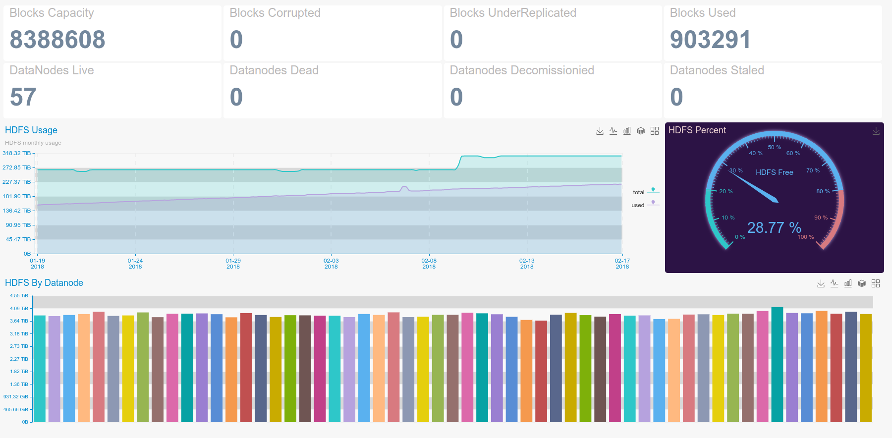
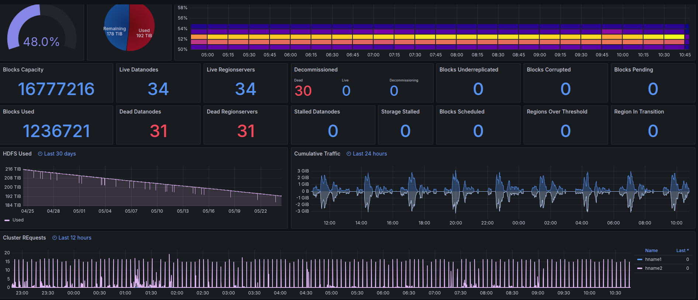

# Hadoop Monitoring with Puypuy

Puypuy uses Hadoop's native JMX-to-JSON HTTP interface to gather performance metrics from both the **NameNode** and **DataNodes** in an HDFS cluster.

All Hadoop-related checks share a single configuration file: `hadoop.ini`.


---

## 🟦 HDFS NameNode



### 🔧 Installation

```bash
cd ${PUYPUY_HOME}/checks_enabled
ln -s ../checks_available/check_hadoop_namenode.py ./

```

In production environments, the NameNode typically listens on a non-loopback interface. Ensure you use the correct external IP address of the NameNode:

***⚙️ Configuration***

```ini
[Hadoop-NameNode]
jmx = http://${NAMENODE_IP}:50070/jmx
```
**🔄 Restart Agent**
```bash
${PUYPUY_HOME}/puypuy.sh restart
```
**📊 Metrics Provided**

| Name  | Description | Type | Unit|
| ------------- | ------------- |------------- |------------- |
|namenode_addblockops|Adblock operations per second|rate|OPS|
|namenode_blockcapacity|HDFS Block Capacity|gauge|None|
|namenode_blockstotal|HDFS Total blocks |gauge|None|
|namenode_capacityremaining|HDFS remaining free space |gauge|Bytes|
|namenode_capacitytotal|HDFS Total capacity|gauge|Bytes|
|namenode_capacityused|HDFS Used space|gauge|Bytes|
|namenode_corruptblocks|HDFS corrupt blocks |gauge|None|
|namenode_createfileops|NameNode Create file operations on nameNode|rate|OPS|
|namenode_deletefileops|NameNode Delete file operations on nameNode|rate|OPS|
|namenode_fileinfoops|NameNode  File information requests|rate|OPS|
|namenode_filesdeleted|NameNode deleted files |rate|OPS|
|namenode_filesrenamed|NameNode rename file operations |rate|OPS|
|namenode_filestotal|Amount of files in HDFS |gauge|None|
|namenode_getblocklocations|NameNode Get Block Location operations |rate|OPS|
|namenode_getlistingops|NameNode Get LIsting operations |rate|OPS|
|namenode_heap_committed|Java Heap memory committed|gauge|Bytes|
|namenode_heap_init|Java Heap memory init|gauge|Bytes|
|namenode_heap_max|Java Heap memory max|gauge|Bytes|
|namenode_heap_used|Java Heap memory used|gauge|Bytes|
|namenode_lastgc_duration|Last garbage collections duration|gauge|Milliseconds|
|namenode_missingblocks|NameNode missing blocks |gauge|None|
|namenode_nondfsusedspace|Non HDFS disk space usage|gauge|Bytes|
|namenode_nonheap_committed|Java Non Heap memory committed|gauge|Bytes|
|namenode_nonheap_init|Java Non Heap memory init|gauge|Bytes|
|namenode_nonheap_max|Java Non Heap memory max|gauge|Bytes|
|namenode_nonheap_used|Java Non Heap memory used|gauge|Bytes|
|namenode_numdeaddatanodes|Number of dead DataNodes in cluster|gauge|None|
|namenode_numdecomdeaddatanodes|Number of decommissioned dead DataNodes in cluster|gauge|None|
|namenode_numdecomlivedatanodes|Number of decommissioned live DataNodes in cluster|gauge|None|
|namenode_numdecommissioningdatanodes|Number of decommissioning DataNodes in cluster|gauge|None|
|namenode_numlivedatanodes|Number of live DataNodes in cluster|gauge|None|
|namenode_numstaledatanodes|Number of stale DataNodes in cluster|gauge|None|
|namenode_numstalestorages|Number of staled Storages in cluster|gauge|None|
|namenode_openfiledescriptorcount|NaeNode process open files descriptors count|gauge|None|
|namenode_pendingreplicationblocks|Amount of pending for replication blocks in HDFS |gauge|None|
|namenode_percentremaining|HDFS Storage space remaining|gauge|Percent|
|namenode_receivedbytes|Namenode received bytes|gauge|Bytes|
|namenode_scheduledreplicationblocks|Amount of blocks scheduled for replication|gauge|None|
|namenode_sentbytes|NameNode sent bytes |gauge|Bytes|
|namenode_transactionsnumops|NameNode transactions count|gauge|None|
|namenode_underreplicatedblocks|HDFS under replicated blocks count|gauge|None|


**🟩 HDFS DataNode**
---------

Most DataNode installations bind to 0.0.0.0:50075, so no custom configuration is typically required.

**🔧 Installation**

```bash
cd ${PUYPUY_HOME}/checks_enabled
ln -s ../checks_available/check_hadoop_datanode.py ./
```

**⚙️ Configuration**

Usually HDFS DataNode binds on 0.0.0.0:50075, so no extra configuration is needed.
 
If you have specific  case, please make sure to change 127.0.0.1 to IP address matching you DataNode bind address.    

```ini
[Hadoop-Datanode]
jmx: http://127.0.0.1:50075/jmx
```

**🔄 Restart Agent**

```bash
${PUYPUY_HOME}/puypuy.sh restart
```

**Provides**

| Name  | Description | Type | Unit|
| ------------- | ------------- |------------- |------------- |
|datanode_bytesread|DataNode read bytes per second|rate|Bytes|
|datanode_byteswritten|DataNode write bytes per second|rate|Bytes|
|datanode_capacity|Disk space on current DataNode|gauge|Bytes|
|datanode_dfsused|Current DataNode’s used disk space|gauge|Bytes|
|datanode_du_percent|Current DataNodes disk usage in percents |gauge|Percent|
|datanode_heap_committed|DataNode JVM heap committed |gauge|Bytes|
|datanode_heap_init|DataNode JVM heap init|gauge|Bytes|
|datanode_heap_max|DataNode JVM Heap max|gauge|Bytes|
|datanode_heap_used|DataNode JVM heap used|gauge|Bytes|
|datanode_lastgc_duration|Duration of last garbage collection |gauge|Milliseconds|
|datanode_nonheap_committed|DataNode JVM non heap committed|gauge|Bytes|
|datanode_nonheap_init|DataNode JVM non Heap init|gauge|Bytes|
|datanode_nonheap_max|DataNode JVM non heap max|gauge|Bytes|
|datanode_nonheap_used|Datanode JVM non Heap used|gauge|Bytes|
|datanode_openfiles|Datanode daemon’s open files descriptors count |gauge|None|
|datanode_space_remaining|Disk space remaining on current DataNode|gauge|Bytes|
|datanode_totalreadtime|Read operations time  on current DataNode|rate|Milliseconds|
|datanode_totalwritetime|Write operations time  on current DataNode|rate|Milliseconds|

***💡 Best Practices***

* 🔐 Security: Always restrict ՝/jmx՝ to internal networks or use firewalls.
* 📈 Dashboards: Visualize metrics in Grafana or similar for better observability.
* 🚨 Troubleshooting: Watch for high GC times, under-replication, or dead DataNodes as early warnings of cluster instability.

***📈 Example of Grafana Dashboard***

