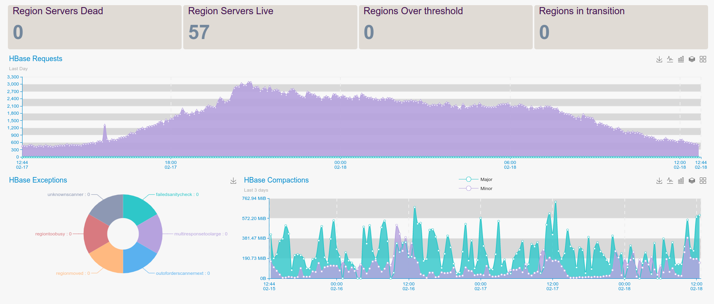

HBase is an open-source non-relational distributed database modeled after Google's Bigtable and written in Java. 
It is developed as part of Apache Software Foundation's Apache Hadoop project and runs on top of HDFS (Hadoop Distributed File System), 
providing Bigtable-like capabilities for Hadoop.

PuyPuy Agent uses HBase built in Json interface, to get statistics from HBase Master and RegionServers
Configuration file for HBase plugin is  `hadoop.ini`. 

#### **HBase Master**



**Install**

```bash
cd ${OE_AGENT_HOME}/checks_enabled
ln -s ../checks_available/check_hbase_master.py ./
```

**Configure**

Usually HBase Master binds on 0.0.0.0:60010, so no extra configuration is needed.
 
If you have specific  case, please make sure to change 127.0.0.1 to IP address matching you HBase Master's  bind address.    

```ini
[HBase-Master]
jmx: http://127.0.0.1:60010/jmx
```

**Restart**

```bash
${OE_AGENT_HOME}/puypuy.sh restart
```

**Provides**

| Name  | Description | Type | Unit|
| ------------- | ------------- |------------- |------------- |
|hmaster_exceptions|General Exceptions|counter|None|
|hmaster_exceptions_failedsanitycheck|Failed Sanity Check Exception|counter|None|
|hmaster_exceptions_multiresponsetoolarge|Multi Response Too Large Exception|counter|None|
|hmaster_exceptions_outoforderscannernext|Out Of Order Scanner Next Exception|counter|None|
|hmaster_exceptions_regionmoved|Region Moved Exception|counter|None|
|hmaster_exceptions_regiontoobusy|Region Too Busy Exception|counter|None|
|hmaster_exceptions_unknownscanner|Unknown Scanner Exception|counter|None|
|hmaster_heap_committed|Hbase Master JVM heap committed|gauge|Byte|
|hmaster_heap_init|Hbase Master JVM heap init|gauge|Byte|
|hmaster_heap_max|Hbase Master JVM heap max |gauge|Byte|
|hmaster_heap_used|Hbase Master JVM heap used|gauge|Byte|
|hmaster_heap_{parnew/g1_young}_lastgcinfo|G1 Youg or ParNew last Garbage collections time |gauge|Milliseconds|
|hmaster_heap_{cms/g1_old}_lastgcInfo|G1 Old or CMS last last Garbage collection time |gauge|Milliseconds|
|hmaster_node_averageload|HBase cluster's load average|gauge|None|
|hmaster_node_clusterrequests|Hbase cluster wide requests per second|rate|OPS|
|hmaster_node_gccount|Hbase Master garbace collections count |counter|None|
|hmaster_node_gctimemillis|Hbase Master garbage collections pause time|gauge|Milliseconds|
|hmaster_node_numdeadregionservers|Number of dead Region Servers |gauge|None|
|hmaster_node_numregionservers|Number of Region Servers|gauge|None|
|hmaster_node_ritcount|The number of regions in transition|gauge|None|
|hmaster_node_ritcountoverthreshold|The number of regions that have been in transition longer than a threshold time|gauge|None|
|hmaster_node_ritoldestage|The age of the longest region in transition| in milliseconds|gauge|Milliseconds|
|hregion_node_memstoresize|Size in bytes of Memstore|gauge|bytes
|hregion_node_regioncount|Amount of regions running on monitored RegionServer|gauge|None|
|hregion_node_storefilesize|Size in bytes of StoreFile|gauge|bytes
|hregion_node_storefilecount|Amount of Store Files on monitored RegionServer|gauge|None|
|hregion_node_hlogfilecount|Amount of HLog Files on monitored RegionServer|gauge|None|
|hregion_node_hlogfilesize|Size in bytes of HLog Files|gauge|bytes
|hregion_node_percentfileslocal|HDFS data locality percentage|gauge|Percent| 
|hregion_node_blockcounthitpercent|Percents of Block Cache hits|gauge|Percent|

#### **HBase RegionServer**

**Install**

```bash
cd ${OE_AGENT_HOME}/checks_enabled
ln -s ../checks_available/check_hbase_regionserver.py ./
```

**Configure**

Usually HBase RegionServer binds on 0.0.0.0:60030, so no extra configuration is needed.
 
If you have specific  case, please make sure to change 127.0.0.1 to IP address matching you HBase Master's  bind address.    

```ini
[HBase-Region]
jmx: http://127.0.0.1:60030/jmx
```

**Restart**

```bash
${OE_AGENT_HOME}/puypuy.sh restart
```

**Provides**

| Name  | Description | Type | Unit|
| ------------- | ------------- |------------- |------------- |
|hregion_heap_cms_lastgcinfo|Duration of previous CMS garbage collection|gauge|Milliseconds|
|hregion_heap_g1_old_lastgcinfo|Duration of previous G1 old generation  garbage collection|gauge|Milliseconds|
|hregion_heap_parnew_lastgcinfo|Duration of previous ParNew garbage collection |gauge|Milliseconds|
|hregion_heap_g1_young_lastgcinfo|Duration of previous G1 young generation  garbage collection|gauge|Milliseconds|
|hregion_heap_committed|HBase RegionServer JVM heap committed |gauge|Bytes|
|hregion_heap_init|HBase RegionServer JVM heap init|gauge|Bytes|
|hregion_heap_max|HBase RegionServer JVM heap max|gauge|Bytes|
|hregion_heap_used|HBase RegionServer JVM heap used|gauge|Bytes|
|hregion_node_blockcachecount|Block cache items count|gauge|None|
|hregion_node_blockcacheevictioncount|Block cache evictions count|gauge|None|
|hregion_node_blockcacheexpresshitpercent|Block cache express hits count|rate|OPS|
|hregion_node_blockcachefreesize|Block cache free size in bytes|gauge|Bytes|
|hregion_node_blockcachehitcount|Block cache hits count per second|rate|OPS|
|hregion_node_blockcachemisscount|Block cache misses count per second|rate|OPS|
|hregion_node_blockcachesize|Block cache size in bytes|gauge|Bytes|
|hregion_node_blockcounthitpercent|Block cache hits percent|gauge|Percent|
|hregion_node_compactedcellscount|Minor compacted cells count per second|rate|OPS|
|hregion_node_compactedcellssize|Minor compacted bytes|rate|Bytes|
|hregion_node_majorcompactedcellscount|Major compacted cells count per second|rate|Bytes|
|hregion_node_majorcompactedcellssize|Major compacted bytes|rate|Bytes|
|hregion_node_gctimemillis|rated affect of last Garbage collection for performed checks interval|rate|Milliseconds|
|hregion_node_gccount|Completed garbage collections|counter|integer|
|hregion_node_openfiledescriptorcount|Linux open files descriptors count by RegionServer’s daemon|gauge|integer|
|hregion_node_delete_num_ops|Number of delete operations performed by current RegionServer per second|rate|OPS|
|hregion_node_flushtime_num_ops|Number of flush operations performed by current RegionServer per second|rate|OPS|
|hregion_node_mutate_num_ops|Number of mutate operations performed by current RegionServer per second|rate|OPS|
|hregion_node_readrequestcount|Number of read operations performed by current RegionServer per second|rate|OPS|
|hregion_node_slowappendcount|Number of slow append operations performed by current RegionServer per second|rate|OPS|
|hregion_node_slowdeletecount|Number of slow delete  operations performed by current RegionServer per second|rate|OPS|
|hregion_node_slowgetcount|Number of slow get operations performed by current RegionServer per second|rate|OPS|
|hregion_node_slowincrementcount|Number of slow increment operations performed by current RegionServer per second|rate|OPS|
|hregion_node_slowputcount|Number of slow put operations performed by current RegionServer per second|rate|OPS|
|hregion_node_totalrequestcount|Total requests per second executed on current RegionServer|rate|OPS|
|hregion_node_writerequestcount|Writes per second executed on current RegionServer|rate|OPS|

**Hedged Reads** (If enabled)

| Name  | Description | Type | Unit|
| ------------- | ------------- |------------- |------------- |
|hregion_node_hedgedreads|Number of started Hedged Read operation |counter|None|
|hregion_node_hedgedreadwins|Number of Hedged Read operation which returned values faster that normal reads |counter|None|


#### **HBase Thrift & REST**

**Install**

```bash
cd {AGENT_HOME}/checks_enabled/
ln -s ../checks_available/check_hbase_rest.py ./
```

```bash
cd {AGENT_HOME}/checks_enabled/
ln -s ../checks_available/check_hbase_thrift.py ./
```

**Configure**

Here is sample config which should be fine for most of HBase installations: Default config parameters are suitable for most of installtions. 
But if your services are running on different IP address or port, just change parameters below to match your installtion .   

```ini
[HBase-Thrift]
jmx : http://127.0.0.1:9095/jmx
```
```ini
[HBase-Rest]
jmx : http://127.0.0.1:9095/jmx
```    
**HBase REST Provides**

| Name  | Description | Type | Unit|
| ------------- | ------------- |------------- |------------- |
|hrest_daemonthreadcount|Running Daemon threads count|gauge|None|
|hrest_faileddelete|Failed Deletes per second|rate|OPS|
|hrest_failedget|Failed Gets per second|rate|OPS|
|hrest_failedput|Failed Puts per second|rate|OPS|
|hrest_failedscancount|Failed Scans per second|rate|OPS|
|hrest_heap_committed|Hbase REST server’s JVM heap committed |gauge|Bytes|
|hrest_heap_max|Hbase REST server’s JVM heap max |gauge|Bytes|
|hrest_heap_used|Hbase REST server’s JVM heap used |gauge|Bytes|
|hrest_nonheap_committed|Hbase REST server’s JVM non heap committed |gauge|Bytes|
|hrest_nonheap_max|Hbase REST server’s JVM npn heap max |gauge|Bytes|
|hrest_nonheap_used|Hbase REST server’s JVM non heap used |gauge|Bytes|
|hrest_pausetimewithgc_90th_percentile|Garbage collectors pause time 90th percentile|gauge|Milliseconds|
|hrest_pausetimewithgc_99th_percentile|Garbage collectors pause time 99th percentile|gauge|Milliseconds|
|hrest_pausetimewithoutgc_90th_percentile|Garbage collectors without pause time 90th percentile|gauge|Milliseconds|
|hrest_pausetimewithoutgc_99th_percentile|Garbage collectors without pause time 99th percentile|gauge|Milliseconds|
|hrest_peakthreadcount|Peak running Daemon threads count|gauge|None|
|hrest_requests|Total requests count executed on this REST gateway|counter|None|
|hrest_successfuldelete|Successful delete requests per second executed on this REST gateway|counter|None|
|hrest_successfulget|Successful get requests count executed  on this REST gateway|counter|None|
|hrest_successfulput|Successful Put requests count executed  on this REST gateway|counter|None|
|hrest_successfulscancount|Successful Scan requests count executed  on this REST gateway|counter|None|
|hrest_threadcount|REST gateway’s running threads count|gauge|None|
|hrest_totalstartedthreadcount|REST gateway’s total threads count|counter|None|

**HBase Thrift Provides**

| Name  | Description | Type | Unit|
| ------------- | ------------- |------------- |------------- |
|hthrift_batchget|Batch gets per second|rate|OPS
|hthrift_batchmutate|Batch mutates per second|rate|OPS
|hthrift_callqueuelen|Length of Thrift queue|gauge|Integer
|hthrift_(cms,g1_old)_lastgcinfo|Duration of last CMS, G1 Old gen garbage collection|current |Milliseconds
|hthrift_daemonthreadcount|Running Daemon threads count|gauge|Integer
|hthrift_heap_committed|JVM heap committed|gauge|Bytes
|hthrift_heap_init|JVM heap Init|gauge|Bytes
|hthrift_heap_max|JVM heap Max|gauge|Bytes
|hthrift_heap_used|JVM heap Used|gauge|Bytes
|hthrift_parnew_lastgcinfo|Duration of last ParNew, G1 Young gen garbage collection|current |Milliseconds
|hthrift_pausetimewithgc_90th_percentile|90th percentile of GC pause time with GC|current |Milliseconds
|hthrift_pausetimewithgc_99th_percentile|99th percentile of GC pause time with GC|current |Milliseconds
|hthrift_pausetimewithoutgc_90th_percentile|90th percentile of GC pause time without GC|current |Milliseconds
|hthrift_pausetimewithoutgc_99th_percentile|99th percentile of GC pause time without GC|current |Milliseconds
|hthrift_peakthreadcount|Thrift gateway’s peak running threads count|gauge|Integer
|hthrift_slowthriftcall|Slow calls|rate|OPS
|hthrift_threadcount|Thrift gateway’s running threads count|gauge|Integer
|hthrift_thriftcall|Amount of thrift calls |rate|OPS
|hthrift_timeinqueue_num_ops|Amount of time object were in Thrift queue |rate|OPS
|hthrift_totalstartedthreadcount|Thrift gateway’s total threads count|gauge|Integer
