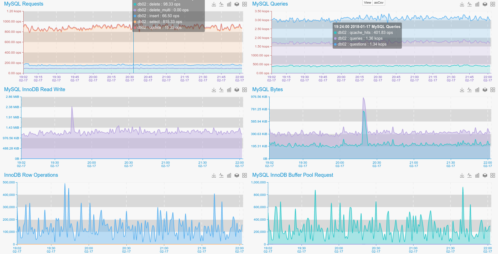

To monitor MySQL server you need : 

1. Install MySQLdb or pymysql module.
2. Create MySQL user with privileges to run `SHOW GLOBAL STATUS`. 
3. Configure Agent with User/Pass/Host, for connecting to Mysql server.  

### **Install MySQL Driver**

If you are running Debian or Ubuntu, use apt-get to install MySQLdb module

```bash
apt-get install python-mysqldb
or
apt-get install python3-mysqldb
```

If you have enabled backports repositories for Debian, you can use it to install pymysql

```bash
apt-get install python-mysqldb
or
apt-get install python3-mysqldb

``` 
For CentOS you can Use YUM.
 
```bash
yum install MySQL-python
```

MySQL drivers can be installed via PIP as well. 

```bash
pip install MySQL-python
or 
pip install pymysql 
```

The reason of adding pymysql support, is that on some Linux distributions (Debian 9), MySQLdb is not working properly.  

###**Create MySQL User**

Login to your MySQL server as root and execute following statement : 

```sql
GRANT USAGE ON *.* TO puypuy@'127.0.0.1' IDENTIFIED BY 'Very-Long-Pa$$w0rd';
FLUSH PRIVILEGES ; 
```
### **Configure Agent**

Copy or symlink `checks_available/check_mysql.py` to `checks_enabled`

```bash
cd ${AGENT_HOME/checks_enabled}
ln -s ../checks_available/check_mysql.py ./ 
```

Edit conf`conf/sql_cache.ini` and put right parameters at **MySQL** section: 

```ini
[MySQL]
host: 127.0.0.1
user: puypuy
pass: Very-Long-Pa$$w0rd
```

### **Provides**

| Name  | Description | Type | Unit|
| ------------- | ------------- |------------- |------------- |
|mysql_bytes_received|MySQL Received bytes |rate|Bytes|
|mysql_bytes_sent|MySQL Sent bytes|rate|Bytes|
|mysql_com_delete|Executed MySQL DELETE commands per second|rate|OPS|
|mysql_com_delete_multi|Executed MySQL Multi DELETE commands per second|rate|OPS|
|mysql_com_insert|Executed MySQL INSERT commands per second|rate|OPS|
|mysql_com_select|Executed MySQL SELECT commands per second|rate|OPS|
|mysql_com_update|Executed MySQL UPDATE commands per second|rate|OPS|
|mysql_connections|Amount of current connections |current |None|
|mysql_innodb_buffer_pool_read_requests|InnoDB buffer pool read requests |rate|OPS|
|mysql_innodb_buffer_pool_write_requests|InnoDB buffer pool write requests |rate|OPS|
|mysql_innodb_data_fsyncs|InnoDB data fsyncs |rate|OPS|
|mysql_innodb_data_read|InnoDB data reads |rate|OPS|
|mysql_innodb_data_writes|InnoDB data writes |rate|OPS|
|mysql_innodb_rows_deleted|InnoDB data deletes|rate|OPS|
|mysql_innodb_rows_inserted|InnoDB inserted rows |rate|OPS|
|mysql_innodb_rows_read|InnoDB read rows |rate|OPS|
|mysql_innodb_rows_updated|InnoDB updated rows |rate|OPS|
|mysql_max_used_connections|Maximum used connection size mysql restart |current |None|
|mysql_open_files|Amount of open file descriptors |current |None|
|mysql_qcache_hits|MySQL query cache hits |rate|OPS|
|mysql_queries|Total number of executed MySQl queries per second |rate|OPS|
|mysql_questions|Total number of executed MySQl questions per second |rate|OPS|
|mysql_slow_queries|Amount of running slow queries |current |None|
|mysql_threads_connected|Amount of currently connected threads |current |None|


