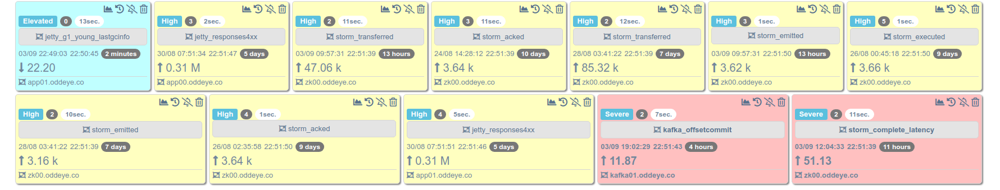

###  **Nagios/Icinga**



**Nagios and Icinga** are popular and powerful open source monitoring applications.
There are tons of plugins for these systems. Recently we have created native integration of Nagios plugins with PuyPuy 
All what's needed is to enable Nagios module `cd ${OE-AGENT-HOME}/checks_enabled && ln -s ../checks_available/nagios.py ./`. 
And configure OE-Agent with Plugins which you want to use. 
In `[Nagios]` section of `conf/nagios.ini` file just write `check_name: command` key value pairs.   

You can write, space separated, parameters for you plugin exactly as you will do when you configure Nagios/Icinga or nagios-nrpe-server. 

```ini
[Nagios]
loadaverage: /usr/lib/nagios/plugins/check_load -w 15,10,5 -c 30,25,20
diskusage:   /usr/lib/nagios/plugins/check_disk -l -w 20% -c 10% -p /dev/sda1
processes:   /usr/lib/nagios/plugins/check_procs -w 250 -c 400
```

After restarting oe-agent you can see alert at you Dashboard, where name of alert is given key at `nagios.ini` nd value is actual value of actual check command. 

###  **Nagios/Icinga client**

OE-Agent can work with Nagion Or Icinga directly acting as remote agent for executing commands. 

for that we need to enable built in webserver and set api key in ```config.ini``` and restart the agent service. 

```ini
[WebServer]
webserver: yes
webaddress: 0.0.0.0:9898
apikey: xxx-xxx-xxx-xxx-xxx-xxx-xxx-xxx
```
Configuration of checks is in `conf/nagios.ini` file, and it looks like this:

```ini
[Nagios]
loadaverage: /usr/lib/nagios/plugins/check_load -w 15,10,5 -c 30,25,20
diskusage:   /usr/lib/nagios/plugins/check_disk -l -w 20% -c 10% -p /dev/sda1
processes:   /usr/lib/nagios/plugins/check_procs -w 250 -c 400
```


After agent is configured to run a webserver and serve nagios plugins, we should configure our Nagios or Icinga server to connect to agent and run checks.
The configuration of Icinga is easy, we need to copy `tools/icingacommands.conf` file to Icinga config directory,  
usually `etc/icinga2/conf.d`,  `tools/naclient.conf` to plugins directory (`/usr/lib/nagios/plugins/`) and restart the Icinga service.

Next we need to donfigure Icinga ckecks as examples below : 

```
object Service "memory" {
  host_name = "HOSTNAME"
  display_name = "Memory Usage"
  check_command = "puypuyclient"
  vars.puypuyclient_address = "ip or hostname of remote agent"
  vars.puypuyclient_port = "port of agent"
  vars.puypuyclient_key = "api key to connect to agent"
  vars.puypuyclient_command = "loadaverage -w 15,10,5 -c 30,25,20"
}
```
The important note for line `vars.puypuyclient_command = "memory -w 20 -c 10 -n`
Command name should be the name defined in `nagios.ini` file.
Parameters can be empty, in this agent will use parameneters which are locally configured in `nagios.ini` . 
If you set parameters in icinga config file it will have higher prority and these parameters will be used to execute the nagios plugin . 