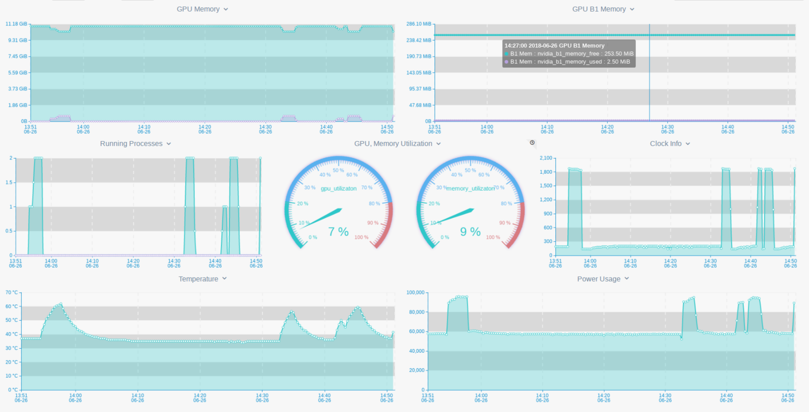

**Nvidia GPU**
---------



Detailed monitoring of **Nvidia GPU** with **OddEye**.  

**Nvidia CUDA** check depends on **nvidia-ml** python module, so in order to use this check **nvidia-ml**  should be installed.    

##### **Install**

You can install **nvidia-ml** with pip or pip3 based on your python version .  
Python2:
```bash
pip install nvidia-ml-py
``` 
Python3: 
```bash
pip3 install nvidia-ml-py3
```

##### **Configure**

**Nvidia CUDA** check does not requires any configuration , 
just enable ```check_nvidia_gpu``` module and restart oe-agent 

```bash
cd ${OE_AGENT_HOME}/checks_enabled/
ln -s ../checks_available/check_nvidia_gpu.py
```

##### **Restart**

```bash
${OE_AGENT_HOME}/oddeye.sh restart
```

##### **Provides**

| Name  | Description | Type | Unit|
| ------------- | ------------- |------------- |------------- |
|nvidia_b1_memory_free|Retrieves the amount of BAR1 free memory available on the device|gauge|Bytes|
|nvidia_b1_memory_total|Retrieves the amount of BAR1 total memory available on the device|gauge|Bytes|
|nvidia_b1_memory_used|Retrieves the amount of BAR1 used memory available on the device|gauge|Bytes|
|nvidia_memory_free|Retrieves the amount of free memory available on the device|gauge|Bytes|
|nvidia_memory_total|Retrieves the amount of total memory available on the device|gauge|Bytes|
|nvidia_memory_used|Retrieves the amount of used memory available on the device|gauge|Bytes|
|nvidia_cuda_processes|Metrics only about compute running processes (e.g. CUDA application which have active context).|gauge|None|
|nvidia_graphic_processes|Metrics only about graphics based processes (eg. applications using OpenGL, DirectX)"|gauge|None|
|nvidia_memory_utilizaton|Current utilization rates for the device's memory subsystems.|gauge|Percent|
|nvidia_gpu_utilizaton|Current utilization rates for the device's gpu subsystems.|gauge|Percent|
|nvidia_fan_speed|The fan speed is expressed as a percent of the maximum, i.e. full speed is 100%."|gauge|Percent|
|nvidia_gpu_clock_info|Current clock speeds for the device.|gauge|None|
|nvidia_gpu_temperature|Current temperature readings for the device, in degrees C."|gauge|Celsius|
|nvidia_power_usage| power usage for this GPU in milliwatts|gauge|Milliwatts |

