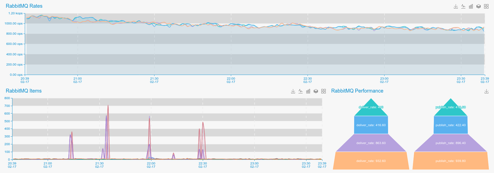

##### **Agent Install**

```bash
cd ${OE_AGENT_HOME}/checks_enabled
ln -s ../checks_available/check_rabbitmq.py ./
```

Or if you are using recent versions of **RabbitMQ** : 

```bash
cd ${OE_AGENT_HOME}/checks_enabled
ln -s ../checks_available/check_rabbitmq_368.py ./
```


##### **Agent Configure**

Edit `conf/mq.ini ` and change user/pass parameters if needed, defaults are below:  

Agent have two modes of monitoring **RabbitMQ**. 

1. Basic Mode (Provides server level metrics, queue, item access rates etc ..)
2. Detailed Mode (Provides per queue metrics) 

For **RabbitMQ** servers older than v3.68:

```ini
[RabbitMQ]
stats: http://127.0.0.1:15672
queue_details: True
user: admin
pass: admin
```

Parameter `queue_details` enables per queue statistics, depending on amount of queues in you **RabbitMQ** server in may significantly increase amount of sending metrics. 


For **RabbitMQ** servers newer than v3.68:

```ini
[RabbitMQ 3.6]
stats: http://127.0.0.1:15672
queue_details: True
desired_queues: beer-queue, deer-queue, bear-queue
user: admin
pass: admin

```

Parameter `queue_details` enables per queue statistics, 
`desired_queues` parameter containf comma seprated list og queues on which you want to have per queue monitoring . 


##### **RabbitMQ Configuration**

**RabbitMQ** has very detailed monitoring interface, but before using, it must be enabled and configured.  
 
To start Monitoring of **RabbitMQ** first we need to create user, and enable management plugin. 

If you already have done that, pass to **Agent Configuration**  

```bash
rabbitmqctl add_user admin admin
rabbitmqctl set_user_tags admin administrator
rabbitmqctl set_permissions -p / admin ".*" ".*" ".*"
```


Enable **RabbitMQ** management plugin:

```bash
rabbitmq-plugins enable rabbitmq_management
```    
    
##### **Restart**

```bash
${OE_AGENT_HOME}/oddeye.sh restart
```

##### **Provides**

| Name  | Description | Type | Unit|
| ------------- | ------------- |------------- |------------- |
|rabbitmq_deliver_rate|rate of delivering messages |rate|OPS|
|rabbitmq_message_bytes_persistent|Amount of disk bytes used for persisting messages |current |Bytes|
|rabbitmq_message_bytes_ram|Amount of memory used for persisting messages |current |Bytes|
|rabbitmq_messages|Message currently in queue |current |None|
|rabbitmq_messages_details|How much the count has changed per second in the most recent sampling interval|rate|OPS|
|rabbitmq_messages_persistent|Message currently in disk queue |current |None|
|rabbitmq_messages_ram|Message currently in memory queue |current |None|
|rabbitmq_messages_ready|Message ready for delivery |current |None|
|rabbitmq_messages_ready_details|How much the messages ready count has changed per second in the most recent sampling interval|rate|OPS|
|rabbitmq_messages_unacknowledged|Amount of unacknowledged messages |current |None|
|rabbitmq_messages_unacknowledged_details|How much the messages unacknowledged count has changed per second in the most recent sampling interval|rate|OPS|
