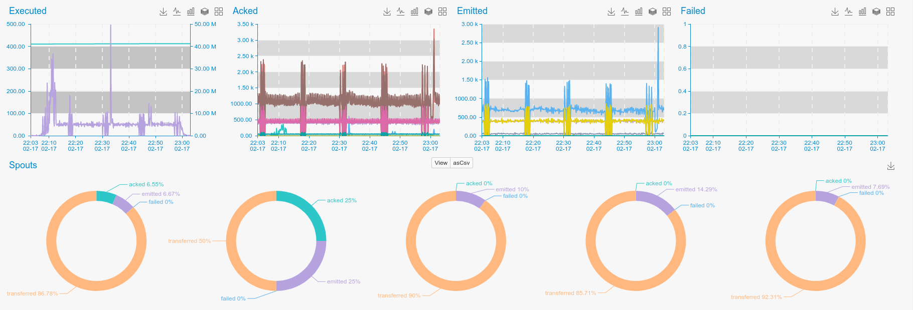
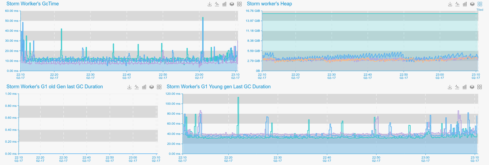

**Apache Storm** is an Open Source distributed real time processing system. 

**PuyPuy** Have two modules for monitoring **Apache Storm**  

1. `check_storm` (Monitors Storm worker processes and exposes Java Lang metrics)
2. `check_storm_api` (Collect's Topology specific metrics from Storm UI-)

### **Storm API**



**Install**

```bash
cd ${OE_AGENT_HOME}/checks_enabled
ln -s ../checks_available/check_ceph.py ./
```

**Configure**

**Storm API** configuration parameters are in `bigdata.ini` file. 
Check supports Topology general aswell as per Spout/Bolt monitoring. 
By default per spout/bolt monitoring is turned on, if you do not need thesedetail, please set `perspout` or `perbolt` to `False`.  

```ini
[Storm-API]
host: 127.0.0.1
port: 8080
perspout: True
perbolt: True
```

**Restart**

```bash
${OE_AGENT_HOME}/puypuy.sh restart
```

**Provides**

| Name  | Description | Type | Unit|
| ------------- | ------------- |------------- |------------- |
|storm_acked|Storm acked requests per second |counter|integer|
|storm_capacity|"Shown runtime capacity| should be around 1.0 "|gauge|None|
|storm_complete_latency|Latency for completing tasks |gauge|Milliseconds|
|storm_emitted|Emitted messages per second |counter|integer|
|storm_execute_latency|Message execution latency |gauge|Milliseconds|
|storm_executed|Storm executions |counter|integer|
|storm_failed|Failed requests |counter|integer|
|storm_process_latency|Storm process latency |gauge|Milliseconds|
|storm_requested_cpu|Requested CPU resources per topology member|gauge|integer|
|storm_requested_mem_off_heap|Requested heap memory per topology member|gauge|Bytes|
|storm_requested_mem_on_heap|Requested non heap memory per topology member|gauge|Bytes|
|storm_transferred|Storm transfers |counter|integer|

### **Storm Workers**


 
In order to gather Storm workers statistics, we need to download and enable **Jolokia JVM Agent**    

#### **Jolokia** 

```bash
cd /usr/share/java/
wget -O jolokia-agent.jar http://search.maven.org/remotecontent?filepath=org/jolokia/jolokia-jvm/1.3.6/jolokia-jvm-1.3.6-agent.jar
```

#### **Configure Storm** 

As far, as **Jolokia JVM Agent** is downloaded, we should configure **Apache Storm**, to use it as JavaAgent for workers and expose metrics via HTTP/Json.
To do this, edit `storm.yaml`. It should be in `STORM_HOME/conf` folder and add or append `worker.childopts` parameters with following: 

```bash
-javaagent:/usr/share/java/jolokia-jvm-agent.jar=port=4%WORKER-PORT%,host=0.0.0.0
``` 

Based on configured `supervisor.slots.ports` Java agent will bind `4%WORKER-PORT%` if you don't like `4`, please feel free to change it to any suitable number. 

By default, storm children binds on 670* ports, so after making changes in `storm.yaml` and restarting **Storm Topology**, you should see something like this,
when you run `netstat -nlptu | grep java` 

```bash
tcp     0   0 0.0.0.0:46700     0.0.0.0:*   LISTEN  6357/java       
tcp     0   0 0.0.0.0:46701     0.0.0.0:*   LISTEN  11281/java
      
tcp     0   0 0.0.0.0:4670x     0.0.0.0:*   LISTEN  11281/java
```

If you see these ports open, you can configure **Agent**, otherwise, something is wrong with configuration.  

#### **Configure Agent**

To configure **Agent**, change working directory to `AGENT_HOME` and :

```bash
cd checks_enabled
ln -s ../checks_available/check_storm_workers.py ./
```

Edit `conf/bigdata.init` and set correct parameters for **Storm** : 

```ini
[Storm]
host: node1
port: 46700,46701,4670x
path: /jolokia/read

``` 

You can set all ports, used by Jolokia or only those, that are interesting for you, separate them by comma and restart **Agent** .

```bash
cd ../ && ./puypuy.sh restart
``` 

#### **Provides** 

Collected metrics will contain extra tag `workerport`, which will match `port`s configured in config file  

| Name  | Description | Type | Unit|
| ------------- | ------------- |------------- |------------- |
|storm_{g1_old/cms}_collectioncount|G1 Old gen or CMS garbage collections count|counter|None|
|storm_{g1_old/cms}_collectiontime|G1 Old gen or CMS garbage collection time|rate|Milliseconds|
|storm_{g1_young/parnew}_collectioncount|G1 Young gen or ParNew garbage collections count|counter|None|
|storm_{g1_young/parnew}_collectiontime|G1 Young gen or ParNew garbage collection time |rate|Milliseconds|
|storm_{g1_young/parnew}_lastgcinfo|G1 Young gen or ParNew garbage collections last GC duration|gauge|MIlliseconds|
|storm_heap_committed|Java Heap memory committed |gauge|Bytes|
|storm_heap_max|Java Heap memory  max|gauge|Bytes|
|storm_heap_used|Java Heap memory used|gauge|Bytes|
|storm_nonheap_committed|Java Non  Heap memory  committed|gauge|Bytes|
|storm_nonheap_max|Java Non  Heap memory  max|gauge|Bytes|
|storm_nonheap_used|Java Non Heap memory used|gauge|Bytes|


