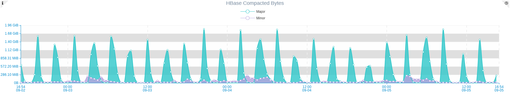
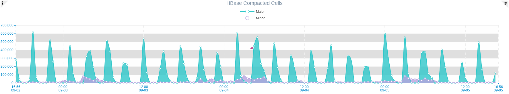
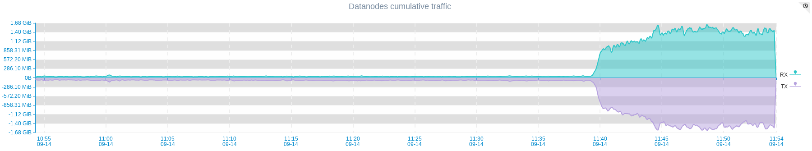

HBase is an distributed wide column database optimized for read performance. 
To chive high read performance it needs to reduce disk seeks, which requires less files per Column Family.  
This approach is not always possible, that’s why HBase periodically merges small files onto one bigger one to reduce disk seek operations for reading requested information. 
This process is called Compaction. 

There are two types of HBase compaction: 

* Minor Compaction 
* Major Compaction 

## Minor compactions

Combines configurable amount of small files and merge it into bigger one. Minor compaction is less resource intensive that Major compaction and takes less time,  
but it happens more frequently. 

##Major Compactions
 
During Major Compaction HBase reads all store files for a Region and writes to a single one.
Both Major and Minor compactions are resource intensive intensive, so  it needs to be properly configured and monitored.
It's very informative to have proper Dashboard for monitoring Compacted bytes and Compacted Cells. 

These metrics are collected per Region Server so better to create aggregated graph which will display cluster level information . 




It will be also usefull to create HBase Regionservers cumulative network charts, to see Cluster wide traffic overview.
During compaction there is huge impact on network, so you should be aware of your traffic to make proper decisions.

Image below illustrated difference of cumulative traffic of all nodes of HBase cluster during compaction processs: 
This gives an idkea sbout impact of compaction on your cluster. 
For sure CPU and load average status of nodes are also changed, but networking changes are more obvious.  



In this image we can see that compaction began at about 11:37 AM. This is Off peak hour for us so its has started at good time. 
But it may happen at the most peak hour as well when traffic is usually several times bigger.
Fortunately HBase is highly configurable systems and allows very granular configuration of compactions lifecycle.  
It allows you to set peak and non peak hours of your cluster and configure compaction speed in accordance to that. 

Below are some configuration parameters from hbase-site.xml which can help you to control speed and resource consumption for compactions. 

Here are some parameters that can help you with fine tuning of compactions: 

```xml
<property>
        <name>hbase.hstore.compaction.max</name>
        <value>10</value>
</property>
```

Maximum number of StoreFiles to compact per minor compaction (default 10)

```xml
<property>
        <name>hbase.hstore.compaction.min.size</name>
        <value>134217728</value>
</property>
```
Minimal store file size to consider file a candidate for compaction. Defaults to hbase.hregion.memstore.flush.size (128 mb).

Also there are several very handy parameters which allows you to set up peak and off peak hours for your cluster and respectively limit bandwidth per interval.  
Value of these settings should be hours passed since 00:00. So examples below configures Off-Peak start hour at 11:00 AM and end hour at 4:00 PM respectively.
 
```xml
<property>
        <name>hbase.offpeak.start.hour</name>
        <value>11</value>
</property>
<property>
        <name>hbase.offpeak.end.hour</name>
        <value>16</value>
</property>
```

Next is to configure proper compaction controller :
 
```xml
<property><name>hbase.hstore.compaction.throughput.controller</name>
    <value>org.apache.hadoop.hbase.regionserver.compactions.PressureAwareCompactionThroughputController</value>
</property>
```

Now when we set up Peak and Off-Peak hours we can set bandwidth thresholds for these periods. 

## Peak hours
```xml
<property>
    <name>hbase.hstore.compaction.throughput.higher.bound</name>
    <value>20971520</value>
    <description>The default is 20 MB/sec</description>
</property>
<property>
    <name>hbase.hstore.compaction.throughput.lower.bound</name>
    <value>10485760</value>
    <description>The default is 10 MB/sec</description>
</property>
```

## Off Peak hours
 
```xml
<property>
	<name>hbase.hstore.compaction.throughput.offpeak</name>
	<value>9223372036854775807</value>
</property>
```

The default is Long.MAX_VALUE, which effectively means no limitation

