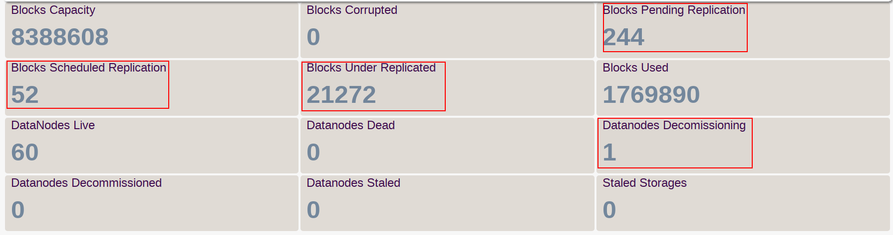
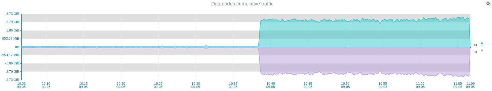
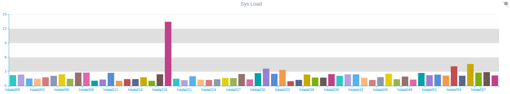

Decommissioning a DataNode replicated its data to active nodes and gracefully removes is from cluster.
If its not done yet, you should add property to ```hdfs-site.xml``` and restart NameNode. 

## Configure NameNode 
 
```xml
<property>
  <name>dfs.hosts.exclude</name>
  <value>/etc/hadoop/conf/dfs.exclude</value>
<property>
```

To decommission a DataNode: Create a file named ```/etc/hadoop/conf/dfs.exclude``` 
Add the name of each DataNode host to be decommissioned to it(one host per line).

## Run Command
  
```commandline
$ hdfs dfsadmin -refreshNodes
```

## Monitor the process 

Now DataNode is marked for decommission and all its blocks are marked as under replicated.
You can create or import [Hadoop Namenode](/puypuy/hadoop/#hdfs-namenode) dashboard and view decommissioning process. 
Or at NameNode UI to view informatin about decommissioning process.


 
Its will be very informative to create chart for cumulative traffic of datanodes like this below and monitor traffic of all nodes . 



This chart clearly shows that decommissioning process is started ate 10:38 and not is actively syncing data between nodes.  

## Be Aware 

Decommission is resource intensive operation , 
It's recommended to decommission no more than two DataNodes at a time and carefully monitor systems load average during decommission process.




##Stop Decommissioning

If you see that the Sys-Load of DataNodes is getting higher that servers can handle, or have any other reason to stop the decommissioning process : 
Remove the DataNode name from /etc/hadoop/conf/dfs.exclude.
Run the command 

```commandline
$ hdfs dfsadmin -refreshNodes
```
